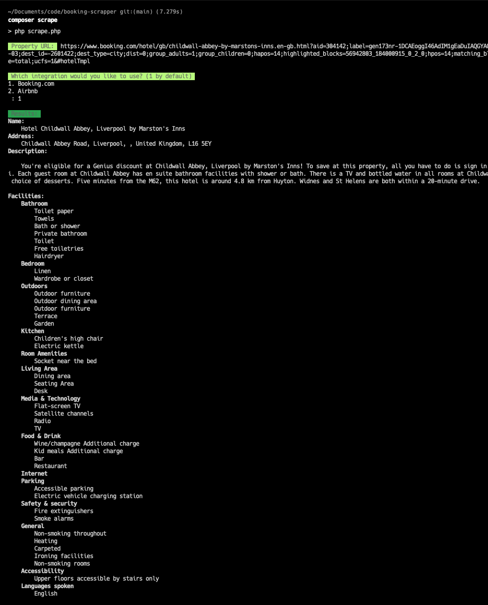

# Property page web scrapper

This tool was built to expermiment with extracting features for property pages on websites like booking.com and Airbnb. This console app will scrape the web-page and extract details about the property and return a single feature model of the data from the provider.

## Implemented providers:

- Booking.com

## Usage

Clone the repo and then run:

```
composer install
```

Then execute a scrape:

```
composer scrape
```

Follow the on-screen prompts

## Output example


